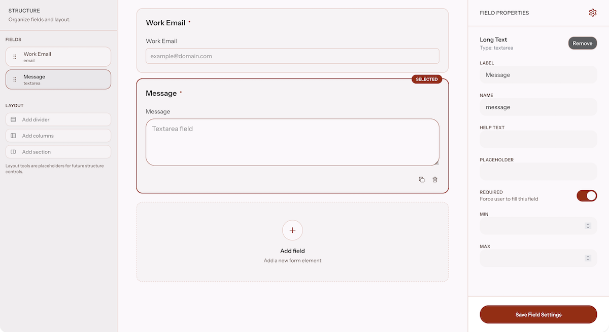

# Form Builder

A schema-driven form builder for creating, organizing, and managing reusable forms through a visual editing experience.




## Features

- Visual form editor
- Schema-driven form rendering
- Drag-and-drop field organization
- Dynamic field configuration
- Responsive editing experience
- User-owned form templates

## Tech Stack

- Laravel 13
- React
- TypeScript
- Inertia.js
- Tailwind CSS
- SQLite

## Requirements

- PHP 8.3+
- Composer
- Node.js 20+

## Installation

Clone the repository:

```bash
git clone <repository-url>
cd <folder-name>
```

Install dependencies:

```bash
composer install
npm install
```

Create the environment file:

```bash
cp .env.example .env
```

Generate the application key:

```bash
php artisan key:generate
```

Run the database migrations:

```bash
php artisan migrate
```

## Running the Application

Start the development environment:

```bash
composer run dev
```

Visit:

```text
http://localhost:8000
```

## Testing

Run the test suite:

```bash
composer run test
```

## Code Style

Check formatting:

```bash
./vendor/bin/pint --test
```

Fix formatting:

```bash
./vendor/bin/pint
```

## Build Assets

```bash
npm run build
```